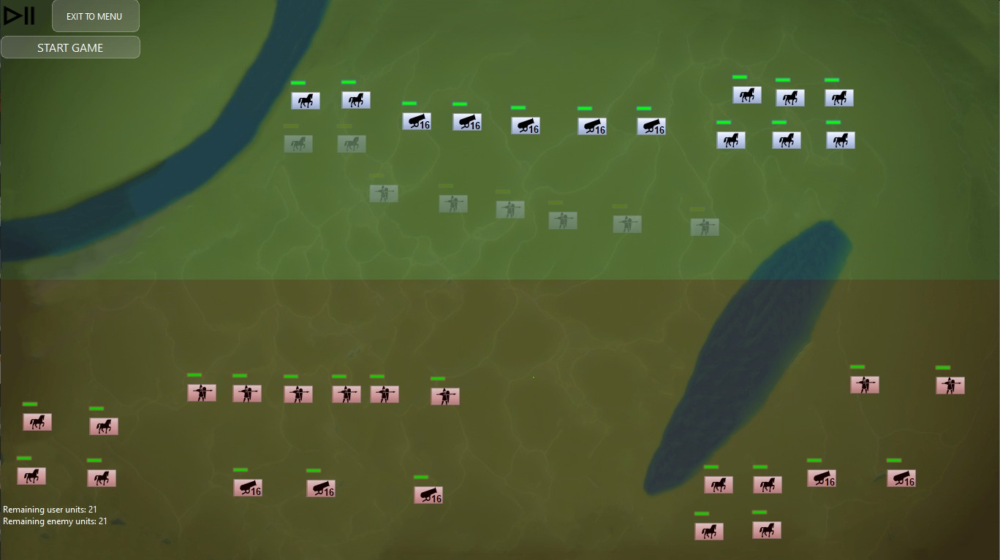
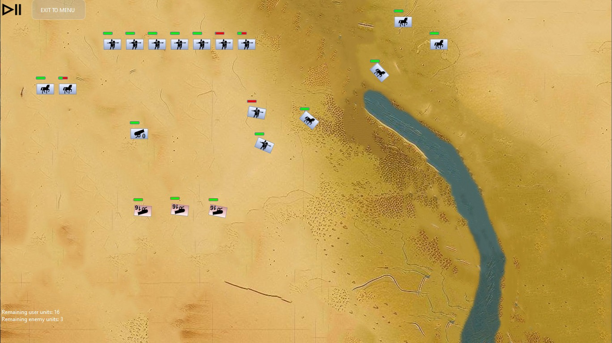

# Historical Battle Simulator
[](https://www.qt.io/)

## Overview

This project is a real-time battle simulator game developed in C++.

## How To Play

Once the scenario is chosen, you will see the deploy screen. All units will initially be deployed in positions based on scenarios. In the deploy screen, you are free to deploy your units as you wish.

To select a unit, **right-click** on any point on the unit. To place a unit in the desired position, **left-click**. The upper half of the battlefield is allowable for deployment for your units, and you can't place any of your units on top of obstacles.

Once you finish your deployment, click the "Start Game" button to begin the battle. AI units, which are your enemies, will start moving towards your units based on a simple algorithm. 


Multiple units can be selected. When you decide to move your units, **left-click** any point on the map. Units will move to their target destination until they encounter either another unit or obstacle. If the unit is from the enemy, your units will combat enemy units. Artillery type units will shoot at enemy units from a certain distance when the units are in its range. Infantry units will charge units. You also have a commander which boosts nearby units. The game will continue until either you or the AI runs out of units. After that You will be taken to the results screen, and the game ends. You can replay the same scenario or exit the game.

## Prerequisites

Before compiling and running the project, make sure you have the following installed on your system:

- C++ Compiler (MinGW or MSVC 2019)
- Qt (version 6 or later)
- Qt Multimedia component

## How to Compile, Execute & Run  

You can open CMakeLists.txt in Qt Creator.

1. Clone the repository:

    ```bash
    git clone https://github.com/BerkeKbskl/BattleSim.git
    ```

2. Build the project:

- Download and install Qt from the official downloading link ,it is recommended to use at least Qt version 6.4.3.
- Add the required library (Qt Multimedia) by using QT maintenance tool. 
- Open Qt Creator > Open Project > Locate project location and select it.
- Build project.
- Once the project is built, you can run it directly from Qt Creator. 

## Documentation:

1. Navigate to the `doxygen` folder.

2. Open the `index.html` file in your preferred web browser to access the Doxygen-generated documentation.


## Notes
- Make sure all dependencies, including the Qt Multimedia component, are correctly installed on your system.

## Contributions

### Berke Kabasakal
- Game, Unit, Artillery, Map, Obstacles, River and Swamp (classes and logic for smoothening), Player, User, Unit assets, AI, Readme.

### Ferhat Onur Özgan
- GameMenu, Game,  UI, Settings, Unit, User, Scenario class and Map Implementations, File operations, mouse operations , Map images, Commander. 

### Osman Oğuz Erol:
- Infantry, Cavalry, Audio, AI, Ideas, Scenario text file writing.
